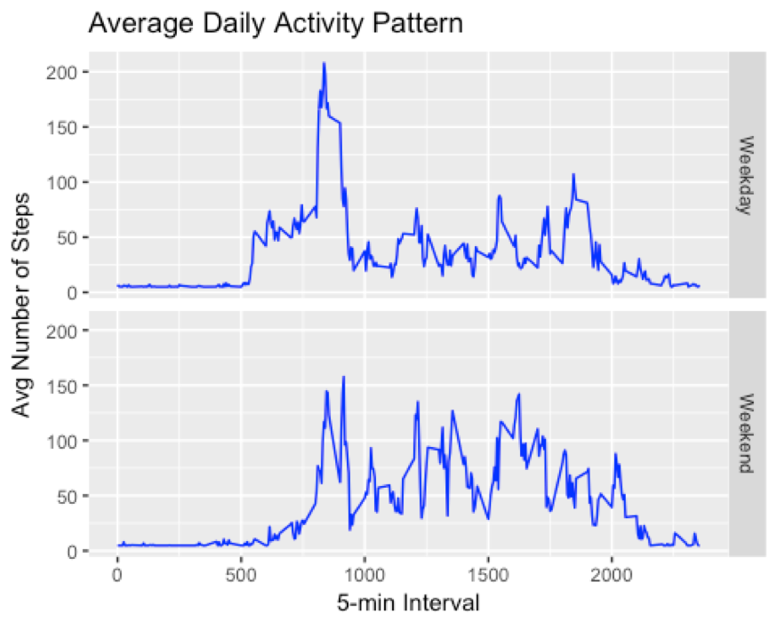

```{r setup, include=FALSE}
knitr::opts_chunk$set(echo = TRUE)
```

## Personal Activities Analysis

Download file and read it in
```{r}
download.file('https://d396qusza40orc.cloudfront.net/repdata%2Fdata%2Factivity.zip', destfile = 'PD.zip')
unzip('PD.zip')
PD = read.csv('activity.csv')
```

## Import Data


```{r Explore data}
head(PD)
pairs(PD)

```
  
```{r Total number of steps taken per day}
 totalSteps = aggregate(steps ~ date, PD, sum)
hist(totalSteps$steps, main = 'Total Steps per Day',xlab = 'Number of Steps', col='blue')
```
  


## Calculate and report the mean and median of the total number of steps taken per day
```{r}
#mean
mean(totalSteps$steps, na.rm = TRUE)
## [1] 10766.19
#median
median(totalSteps$steps, na.rm=TRUE)
## [1] 10765

```

## What is the average daily activity pattern?
```{r}
library(ggplot2)

meanStep = aggregate( steps ~ interval, PD, mean)
ggplot( aes(x=interval, y= steps), data=meanStep) +
  geom_line()+ 
  xlab('5-min interval') + ylab('Avg Number of Steps') + ggtitle('Average Daily Activity Pattern')
```

  
 
```{r}
# Which 5-minute interval across all days contain the maximum number of steps
meanStep[which.max(meanStep$steps),]
```

## Imputing missing values

Calculate and report the total number of missing values in the dataset (i.e. the total number of rows with NAs)
```{r}
sum(is.na(PD$steps))
## [1] 2304

```

## Devise a strategy for filling in all of the missing values in the dataset. The strategy does not need to be sophisticated. For example, ## you could use the mean/median for that day, or the mean for that 5-minute interval, etc.

```{r}
# find na positions to fill in
na_pos = which(is.na(PD$steps))
#use mean to fill in for that day
vec = rep(mean(PD$steps, na.rm = TRUE), times = length(na_pos))
PD[na_pos, 'steps'] = vec

#compute total number of steps each day
PDmeanDay = aggregate(steps ~date, PD,sum)

hist(PDmeanDay$steps,
     col = 'blue',
     xlab = 'Total Number of Steps',
     main = 'Histogram of Total Number of Steps taken each Day')
#mean
mean(PDmeanDay$steps)
## [1] 10766.19
#median
median(PDmeanDay$steps)
## [1] 10766.19

```

  


## Are there differences in activity patterns between weekdays and weekends?

```{r}
#add days
PD$date = as.POSIXct(PD$date, format="%Y-%m-%d")
weekdays = (weekdays(PD$date))
PD = cbind(PD, weekdays)
PD = cbind(PD, daytype = ifelse(PD$weekdays =='Saturday'|
             PD$weekdays == 'Sunday', 'Weekend','Weekday'))
head(PD)

#Make a panel plot containing a time series plot (i.e. type = "l") of the 5-minute interval (x-axis) and the average number of steps taken, averaged across all weekday days or weekend days (y-axis).

meanStepDay = aggregate(steps ~ interval+daytype, PD, mean)


ggplot(meanStepDay, aes(x=interval, y= steps))+
  geom_line(col ='blue') +
  facet_grid(daytype ~.)+
  ggtitle('Average Daily Activity Pattern')+
  xlab('5-min Interval')+
  ylab('Avg Number of Steps')
```

  
